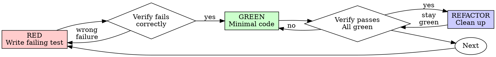

# Test-Driven Development (TDD)

## Overview

Write test first. Watch it fail. Write minimal code to pass.

Core principle: If you didn't watch it fail, you don't know if it tests the right thing.

Violating the letter of the rules is violating the spirit of the rules.

## When to Use

Always: new features, bug fixes, refactoring, behavior changes.

Exceptions, ask your human partner:
- Throwaway prototypes
- Generated code
- Configuration files

Thinking "skip TDD just this once"? Stop. That's rationalization.

## The Iron Law

```txt
NO PRODUCTION CODE WITHOUT A FAILING TEST FIRST
```

Write code before the test? Delete it. Start over.

No exceptions:
- Don't keep it as "reference"
- Don't "adapt" it while writing tests
- Don't look at it
- Delete means delete

Implement fresh from tests.

## Red-Green-Refactor



### RED: Write Failing Test

Write one minimal test for desired behavior.

<Good>

```typescript
test('retries failed operations 3 times', async () => {
  let attempts = 0;
  const operation = () => {
    attempts++;
    if (attempts < 3) throw new Error('fail');
    return 'success';
  };

  const result = await retryOperation(operation);

  expect(result).toBe('success');
  expect(attempts).toBe(3);
});
```

Clear name, tests real behavior, one thing.

</Good>

<Bad>

```typescript
test('retry works', async () => {
  const mock = jest.fn()
    .mockRejectedValueOnce(new Error())
    .mockRejectedValueOnce(new Error())
    .mockResolvedValueOnce('success');
  await retryOperation(mock);
  expect(mock).toHaveBeenCalledTimes(3);
});
```

Vague name, tests mock not code.

</Bad>

Requirements:
- One behavior
- Clear name
- Real code, no mocks unless unavoidable

### Verify RED: Watch It Fail

**MANDATORY. Never skip.**

```bash
npm test path/to/test.test.ts
```

Confirm:
- Test fails, not errors
- Failure message is expected
- Fails because feature is missing, not because of typos

Test passes? It does not prove new behavior. Fix test.

Test errors? Fix error, re-run until it fails correctly.

### GREEN: Minimal Code

Write simplest code that passes.

<Good>

```typescript
async function retryOperation<T>(fn: () => Promise<T>): Promise<T> {
  for (let i = 0; i < 3; i++) {
    try {
      return await fn();
    } catch (e) {
      if (i === 2) throw e;
    }
  }
  throw new Error('unreachable');
}
```

Just enough to pass.

</Good>

<Bad>

```typescript
async function retryOperation<T>(
  fn: () => Promise<T>,
  options?: {
    maxRetries?: number;
    backoff?: 'linear' | 'exponential';
    onRetry?: (attempt: number) => void;
  }
): Promise<T> {
  // YAGNI
}
```

Over-engineered.

</Bad>

Don't add features, refactor unrelated code, or "improve" beyond the test.

### Verify GREEN: Watch It Pass

**MANDATORY.**

```bash
npm test path/to/test.test.ts
```

Confirm:
- Test passes
- Other tests still pass
- Output pristine, no errors or warnings

Test fails? Fix code, not test.

Other tests fail? Fix now.

### REFACTOR: Clean Up

After green only:
- Remove duplication
- Improve names
- Extract helpers

Keep tests green. Add no behavior.

### Repeat

Next failing test for next feature.

## Good Tests

| Quality | Good | Bad |
|---------|------|-----|
| Minimal | One thing. "and" in name? Split it. | `test('validates email and domain and whitespace')` |
| Clear | Name describes behavior | `test('test1')` |
| Shows intent | Demonstrates desired API | Obscures what code should do |

When writing or changing tests, read [writing-good-tests.md](writing-good-tests.md):
- Name production change that would make test fail before writing it
- Assert real behavior, never mock behavior
- Keep test-only code in test utilities, out of production classes
- Understand dependency side effects before mocking it

## Common Rationalizations

| Excuse | Reality |
|--------|---------|
| "Too simple to test" | Simple code breaks. Test takes 30 seconds. |
| "I'll test after" | Tests-after pass immediately, so you never prove they can catch the bug. They are biased toward implementation and cases you already remembered. |
| "Tests after achieve same goals (spirit not ritual)" | Tests-after answer "what does this do?" Tests-first answer "what should this do?" Coverage without observed failure does not prove the test works. |
| "Already manually tested" | Manual testing leaves no repeatable record and is easy to miss under pressure. "Worked when I tried it" is not regression protection. |
| "Deleting X hours is wasteful" | Sunk cost. Choice is rewrite with TDD or keep unproven code and bolt tests on afterward. |
| "Keep as reference, write tests first" | You'll adapt it. That's testing after. Delete means delete. |
| "Need to explore first" | Fine. Throw away exploration, start with TDD. |
| "Test hard = design unclear" | Listen to test. Hard to test = hard to use. |
| "TDD will slow me down" | TDD catches bugs before commit, prevents regressions, and makes refactoring safe. Shortcuts move cost to debugging. |
| "Manual test faster" | Manual tests are not repeatable regression checks. You'll repeat them after every change. |
| "Existing code has no tests" | You're improving it. Add tests for existing code. |

## Red Flags: STOP and Start Over

- Code before test
- Test after implementation
- Test passes immediately
- Can't explain why test failed
- Tests added "later"
- Rationalizing "just this once"
- "I already manually tested it"
- "Tests after achieve the same purpose"
- "It's about spirit not ritual"
- "Keep as reference" or "adapt existing code"
- "Already spent X hours, deleting is wasteful"
- "TDD is dogmatic, I'm being pragmatic"
- "This is different because..."

**All of these mean: Delete code. Start over with TDD.**

## Example: Bug Fix

Bug: Empty email accepted.

RED:

```typescript
test('rejects empty email', async () => {
  const result = await submitForm({ email: '' });
  expect(result.error).toBe('Email required');
});
```

Verify RED:

```txt
$ npm test
FAIL: expected 'Email required', got undefined
```

GREEN:

```typescript
function submitForm(data: FormData) {
  if (!data.email?.trim()) {
    return { error: 'Email required' };
  }
  // ...
}
```

Verify GREEN:

```txt
$ npm test
PASS
```

REFACTOR:

Extract validation for multiple fields if needed.

## Verification Checklist

Before marking work complete:

- [ ] Every new function/method has a test
- [ ] Watched each test fail before implementing
- [ ] Each test failed for expected reason, feature missing rather than typo
- [ ] Wrote minimal code to pass each test
- [ ] All tests pass
- [ ] Output pristine, no errors or warnings
- [ ] Tests use real code, mocks only if unavoidable
- [ ] Edge cases and errors covered

Can't check all boxes? You skipped TDD. Start over.

## When Stuck

| Problem | Solution |
|---------|----------|
| Don't know how to test | Write wished-for API. Write assertion first. Ask your human partner. |
| Test too complicated | Design too complicated. Simplify interface. |
| Must mock everything | Code too coupled. Use dependency injection. |
| Test setup huge | Extract helpers. Still complex? Simplify design. |

## Debugging Integration

Bug found? Write failing test reproducing it, then follow TDD. Test proves fix and prevents regression.

Never fix bugs without a test.

## Final Rule

```txt
Production code: test exists and failed first
Otherwise: not TDD
```

No exceptions without your human partner's permission.
